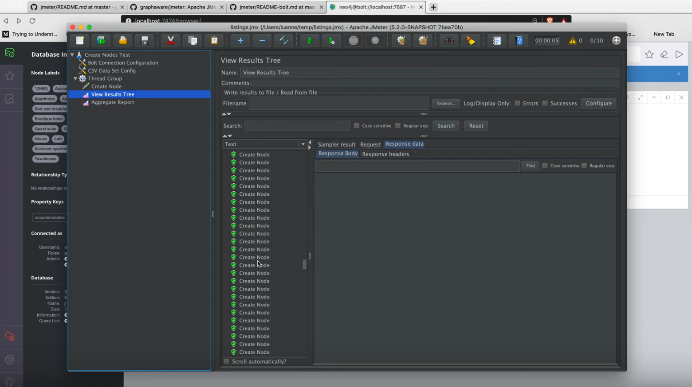
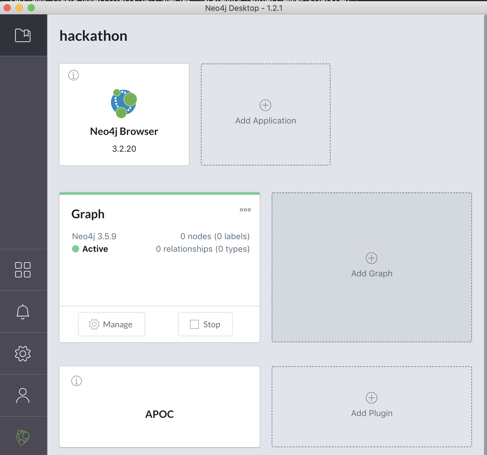

=== How to use JMeter to load test your Neo4j custom procedures / queries

When working with https://neo4j.com/[Neo4j], sometimes you need to create custom procedures to handle
use cases like advanced permissions, custom traversals, or high performance data import.

https://jmeter.apache.org/[JMeter] is a popular tool for load testing, and can be used
to build complex testing scenarios, with custom ramp up periods, sample data
as CSV file, ...

This repository contains help on how to configure and use JMeter to run Neo4j queries
through the https://boltprotocol.org/[Bolt protocol].

[.line-through]#It uses a custom version of JMeter that handles the bolt protocol,
which can be found at https://github.com/graphaware/jmeter/.
Check out the build instructions located in the `README-bolt.md`.
We are working with the JMeter team to integrate bolt into
the main JMeter codebase, so hopefully, it won't be necessary to run a custom build
in the future.#
This is natively supported from JMeter 5.2. Until it's released, you can use the lastest nightly build
https://builds.apache.org/job/JMeter-trunk/lastSuccessfulBuild/artifact/src/dist/build/distributions/apache-jmeter-5.2.0-SNAPSHOT.tgz[here]

Check out the `examples` directory in this repo, and the introduction video
to load testing a procedure with JMeter: https://youtu.be/Zqyeo0iShF4
[#img-jmeter]
[link=https://youtu.be/Zqyeo0iShF4]

These examples have been created at the occasion of the
https://globalgraphhack.devpost.com/[2019 Global GraphHack].

Happy load testing!  :rocket:

==== Requirements

To run these test plans, you need a running Neo4j database, with APOC extension installed.

If you don't have a Neo4j database, https://neo4j.com/download/[download a Neo4j Desktop]

Then create a new project and add the APOC plugin to it

