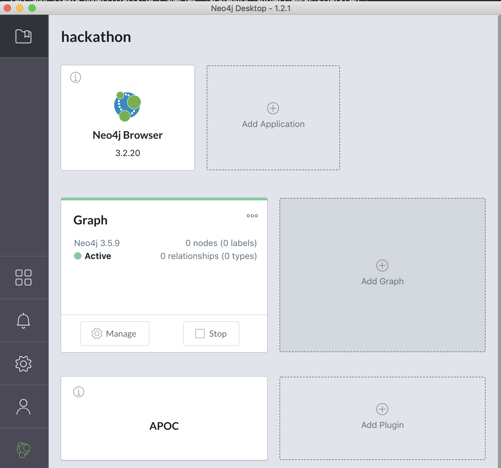

== Requirements

To run this test plan, you need:

- the biodiversity dataset downloadable https://www.kaggle.com/nationalparkservice/park-biodiversity/[here]
- a running Neo4j database, with APOC extension installed

If you don't have a Neo4j database, https://neo4j.com/download/[download a Neo4j Desktop]

Then create a new project and add the APOC plugin to it

== Running the test

- Open the test plan in JMeter
- Adapt the CSV file location in the `CSV Data Set Config`
- Run the test and check out the results in the `Aggregate report` element

